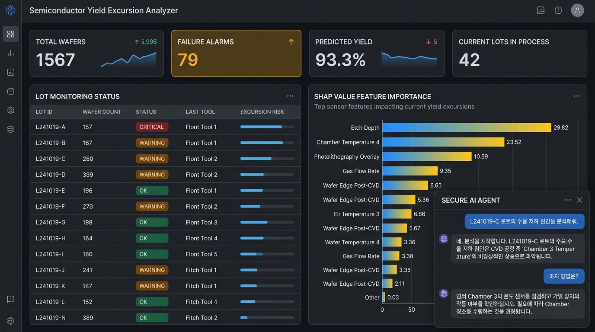
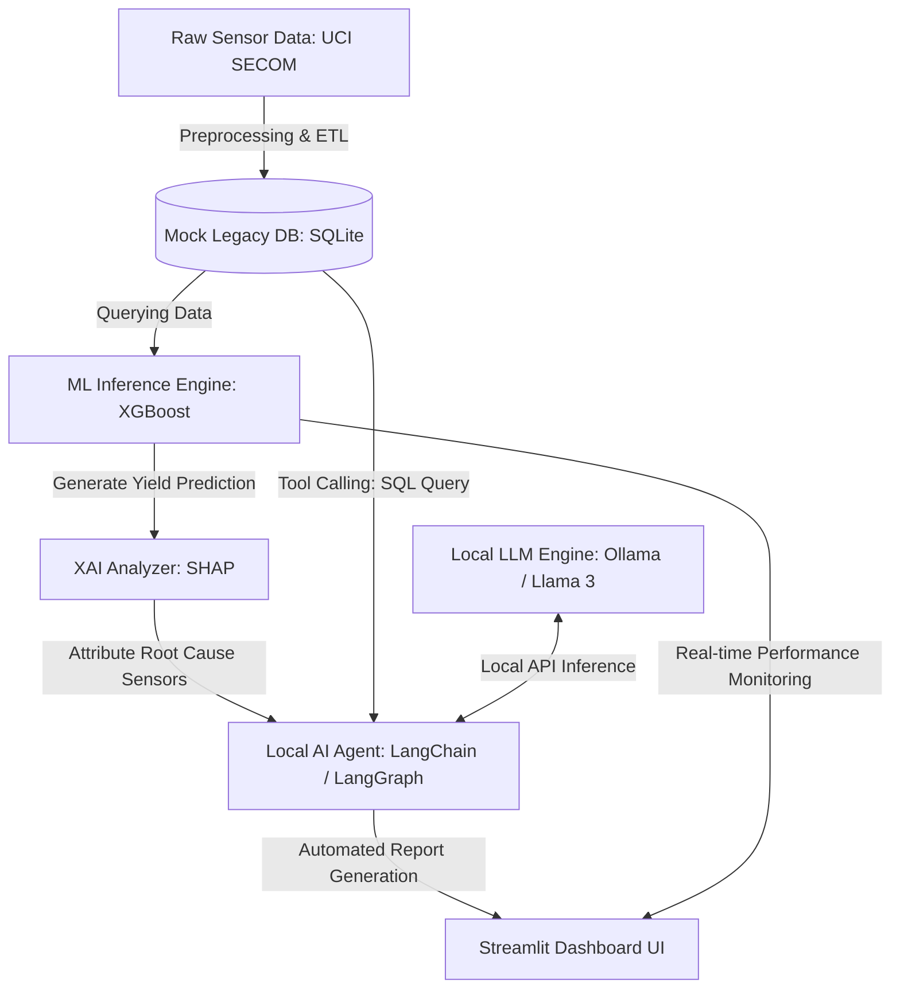

# Semiconductor Yield Excursion Copilot 🏭

> **100% On-Premise Secure AI Agent for Tabular Sensor Yield Diagnostics in Semiconductor Manufacturing**



This repository implements an end-to-end, secure, offline AI co-pilot system for semiconductor manufacturing yield analysis. It combines XGBoost-based anomaly detection, explainable AI (SHAP) feature attribution, SQLite-based legacy data modeling, and local LLM agents (via Ollama) to assist fab yield engineers in root-cause diagnosis without cloud data leakage.

---

## 🏗️ System Architecture & Data Flow



1. **Local Legacy DB (SQLite):** Simulates a factory MES/FDC system storing Lot IDs, wafer metadata, operator records, and 590 raw sensor readings.
2. **Predictive Engine (XGBoost):** Classifies wafer anomalies. Optimized using decision-threshold tuning and pos-weight scaling to handle extreme class imbalance (only 6.6% failures).
3. **Local Explainer (SHAP):** Decomposes positive prediction scores to identify the top 5 sensor variables driving the yield anomaly.
4. **Secure AI Agent (Ollama + Llama 3):** Routes natural language queries, queries the SQLite database, checks local SHAP scores, and drafts engineering warning reports 100% offline.
5. **Yield Dashboard (Streamlit):** Visualizes lot-level risks, highlights flagged wafers, and runs the secure copilot agent chat box.

---

## 🚀 Key Performance & Diagnostic Metrics

* **Dataset:** UCI SECOM (1,567 samples, 590 sensor features).
* **Validation Strategy:** Chronological split (80% train, 20% test) to prevent future data leakage (temporal drift).
* **Features Filtered:** 116 constant features removed; 28 features with >50% missing values removed.
* **Failure Alarm Recall:** **35.29%** achieved on chronological test set by optimizing decision threshold to **0.050** to maximize target F1-score.
* **Top Global Failure Sensor:** **`sensor_59`** identified as the primary overall failure driver.

---

## 📂 Repository Structure

```
├── data/                       # Local raw data & SQLite database
├── src/
│   ├── download_and_eda.py     # Day 1: Dataset downloader & EDA reporting
│   ├── build_mock_db.py        # Day 2: SQLite database builder & MES simulator
│   ├── train.py                # Day 3: Baseline model training & threshold tuning
│   ├── explain.py              # Day 4: SHAP local/global explanation generator
│   └── dashboard.py            # Day 5: Streamlit yield monitoring UI
│   └── agent.py                # Day 6: Ollama secure local LLM routing & tools
├── models/                     # Saved model pipelines (*.joblib)
├── reports/                    # Generated markdown reports & diagnostic data
└── requirements.txt            # Python dependencies
```

---

## 🔧 Installation & How to Run

### 1. Pre-requisites & Local LLM Setup
Ensure you have **Ollama** installed on your macOS:
1. Download from [Ollama.com](https://ollama.com).
2. Pull your local LLM model of choice:
   ```bash
   ollama pull gemma2
   # or
   ollama pull llama3
   ```

### 2. Setup Python Virtual Environment
Clone this repository and set up dependencies:
```bash
# Create and activate virtual environment
python3 -m venv venv
source venv/bin/activate

# Install required libraries
pip install -r requirements.txt
```

*(If running on Mac and XGBoost complains about OpenMP libraries, run `brew install libomp` in your shell).*

### 3. Execution Pipeline (Chronological Workflow)

Run the script suite step-by-step:

```bash
# Step 1: Download dataset and execute exploratory data analysis
python3 src/download_and_eda.py

# Step 2: Set up the local SQLite manufacturing database
python3 src/build_mock_db.py

# Step 3: Train XGBoost and LightGBM models & optimize thresholds
python3 src/train.py

# Step 4: Run local/global SHAP analyses on predicted failures
python3 src/explain.py

# Step 5: Start the live Streamlit yield monitoring dashboard
streamlit run src/dashboard.py
```

Open [http://localhost:8501](http://localhost:8501) in your browser to view the interactive dashboard.

---

## 🔒 Manufacturing Domain Value: Why On-Premise?

In high-tech semiconductor fabs, data confidentiality is critical. Cloud-based LLMs pose a major risk of intellectual property leakage (sensor patterns can reveal proprietary recipes). 

By structuring this system around a **Local Tabular ML model (XGBoost)** paired with an **On-Premise LLM (Ollama)** running within the corporate intranet, fab operators obtain the benefits of generative AI and automated diagnostics while maintaining **complete data security compliance**.
