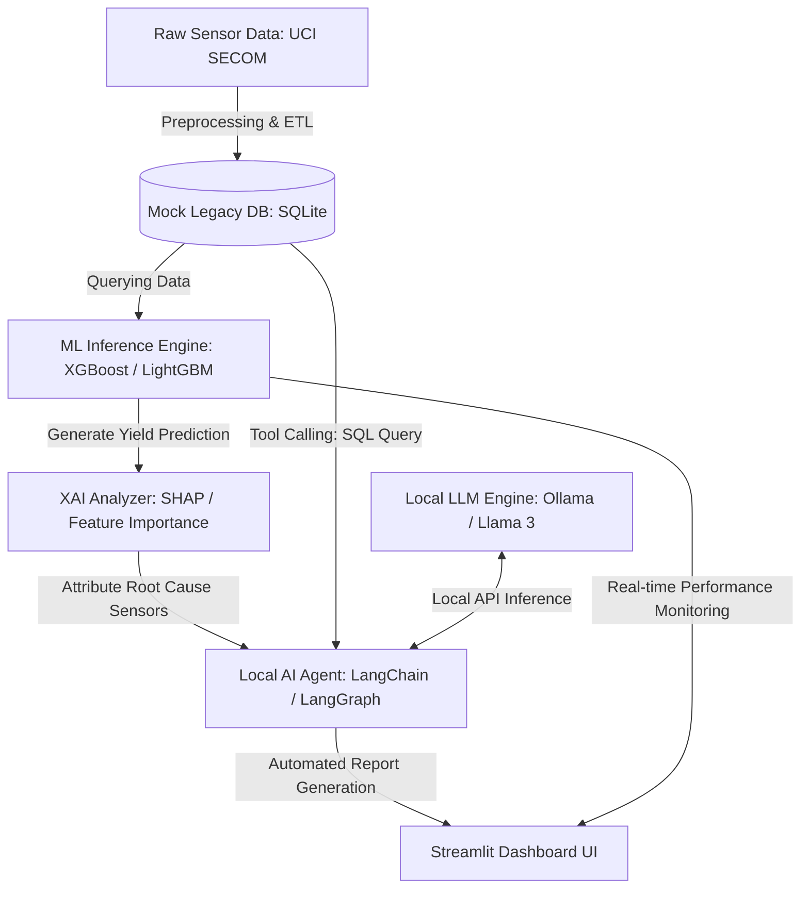

                                                                                                                                                                                             
• 내 기준으로 나누면 이렇게 봅니다.                                                                                                                                                            
                                                                                                                                                                                               
  네가 가장 흥미로워할 가능성이 큰 직무: AI/DT                                                                                                                                                 
  채용자가 봤을 때 가장 적합하게 포지셔닝하기 좋은 직무: Digital Factory                                                                                                                       
                                                                                                                                                                                               
  1. 네가 가장 흥미로워할 가능성: AI/DT                                                                                                                                                        
                                                                                                                                                                                               
  너는 지금 Phone과 AI Glass 사이의 middleware, connection lifecycle, pairing, transport, power policy, logging/diagnostics 같은 새 디바이스 플랫폼의 시스템 문제를 다루고 있습니다. 이건 정해 
  진 웹서비스를 만드는 것보다 훨씬 불확실하고, 디바이스/OS/통신/UX가 얽힌 영역입니다.                                                                                                          
                                                                                                                                                                                               
  AI/DT 직무는 PDF상으로도 AI Agent 설계 및 개발, RAG, 파인튜닝, Legacy 시스템 연동, 서비스 UI/UX 구현이 중심입니다. 즉 “AI를 깊게 연구하는 사람”보다는, 현장 문제를 듣고 AI Agent를 실제 서비 
  스로 만들어내는 쪽에 가깝습니다.                                                                                                                                                             
                                                                                                                                                                                               
  너한테 흥미로울 지점은 이겁니다.                                                                                                                                                             
                                                                                                                                                                                               
  - 아직 정형화되지 않은 AI Agent 시스템을 직접 설계                                                                                                                                           
  - LLM을 현장 업무 자동화에 붙임                                                                                                                                                              
  - Legacy 시스템과 AI 서비스를 연결                                                                                                                                                           
  - 단순 분석보다 실제 서비스화/운영까지 감                                                                                                                                                    
  - 빠르게 생산성을 높이는 도구를 만드는 성격                                                                                                                                                  
                                                                                                                                                                                               
  네가 말한 “AI에 대한 깊은 이해는 아직 없지만, AI를 활용한 효율화와 빠른 생산성에 관심이 크다”는 성향과 잘 맞습니다. 다만 약점도 분명합니다. JD에 LangChain, LangGraph, RAG, Vector DB,       
  Transformer, Prompt Engineering이 필수에 가깝게 적혀 있어서, 지원 전에는 작은 AI Agent 포트폴리오 하나가 거의 필요합니다

2. 채용자가 봤을 때 가장 적합하게 보일 직무: Digital Factory

  Digital Factory는 네 현재 경력을 가장 자연스럽게 번역하기 좋습니다. 이 직무는 M&T/Diffusion 제조기술 조직 안에서 Legacy System과 AI Agent를 연계하고, 제조기술 현장의 분석/실행 프로세스를 AI
  중심으로 바꾸는 역할입니다.

  네 경력과 맞닿는 부분은 AI 자체보다 아래입니다.

  - Phone/Core/Glass 간 복잡한 시스템 연동 경험
  - Bluetooth, BLE, Wi-Fi, endpoint, secure channel 등 transport/lifecycle 이해
  - device state, wear state, power state, reconnect 같은 상태 머신 문제 경험
  - field log/dumpstate 기반 원인 분석 경험
  - middleware 레벨에서 여러 앱/서비스/HAL/플랫폼을 연결한 경험
  - 안정성, 재연결성, 전력 효율, observability를 같이 보는 경험

  Digital Factory JD의 핵심도 결국 “현장 Legacy System과 AI Agent를 연결해서 업무 프로세스를 바꾸는 것”입니다. 네 프로젝트는 제조 도메인은 아니지만, 복잡한 제품 시스템의 여러 레이어를 연결하
  고 문제를 추적해 개선한 경험이라는 점에서 꽤 설득력이 있습니다.

  지원자 관점에서 이렇게 포지셔닝하면 좋습니다.

  저는 Phone-AI Glass 간 middleware/platform 개발을 하며,
  연결 lifecycle, transport policy, power state, wearable state,
  diagnostics/logging을 end-to-end로 다뤄왔습니다.

  Digital Factory에서도 제조 현장의 Legacy System, 장비/공정 데이터,
  AI Agent, 사용자 workflow가 유기적으로 연결되어야 하므로,
  복잡한 시스템을 구조화하고 안정적으로 연계하는 경험을 활용할 수 있습니다.

  4개 중 추천 순위

  흥미 기준:
  1. AI/DT
  2. Digital Factory
  3. 제조혁신
  4. AI/Data Engineering

  채용 적합도 기준:
  1. Digital Factory
  2. AI/DT
  3. 제조혁신
  4. AI/Data Engineering

  제조혁신은 네가 좋아할 만한 “새로운 영역”은 맞지만, JD상으로는 전략/기획/로드맵/도입 타당성/프로젝트 리딩 성격이 강합니다. 직접 시스템을 만들고 문제를 파고드는 성향이면 답답할 수 있습니다.

  AI/Data Engineering은 이름은 좋아 보이지만, PDF 내용을 보면 반도체 공정이나 AI Agent 제품 개발보다는 건설 Project 설계/기획/Readiness 쪽입니다. 네 현재 AI Glass middleware 경험과는 연결고리
  가 가장 약합니다.

  결론적으로, 지원 전략은 Digital Factory를 1순위로 두고, AI/DT를 도전 카드로 보는 게 좋습니다.
  Digital Factory에는 현재 경력을 “복잡한 플랫폼/미들웨어 연계 경험”으로 강하게 팔 수 있고, AI/DT에는 “AI Agent 개발 포트폴리오를 빠르게 만들어 보완”하면 도전해볼 만합니다.

TErm proejct
제일 매력적인 주제는 이거라고 봅니다.                                                                                                                                                        
                                                                                                                                                                                               
  추천 주제                                                                                                                                                                                    
  “Semiconductor Yield Excursion Copilot: 공정 센서 데이터 기반 수율 Fail 예측 + 원인 후보 리포트 자동화 Agent”                                                                                
                                                                                                                                                                                               
  이게 Digital Factory JD와 가장 잘 맞습니다. 이유는 단순 ML 프로젝트가 아니라, JD에 나온 키워드인 Python/SQL, 제조 데이터 분석, AI 모델, LLM/AI Agent, Legacy System 연계, 보고서화를 한 번에 
  보여줄 수 있기 때문입니다.                                                                                                                                                                   
                                                                                                                                                                                               
  데이터는 UCI SECOM 데이터셋을 쓰는 게 좋습니다. 공식 설명상 반도체 제조 공정 데이터이고, 1,567개 샘플, 591개 센서/측정 feature, pass/fail yield label, timestamp가 있습니다. 결측치도 있어서 
  실제 제조 데이터 느낌이 납니다. 라이선스도 CC BY 4.0이라 포트폴리오에 쓰기 좋습니다.                                                                                                         
  출처: https://archive.ics.uci.edu/dataset/179/secom                                                                                                                                          
                                                                                                                                                                                               
  왜 이 주제가 좋은가                                                                                                                                                                          
  이 JD의 Digital Factory는 “AI 연구”보다 제조기술 현장 업무를 AI 중심으로 바꾸는 역할입니다. 그래서 단순히 “수율 예측 모델 만들었습니다”에서 끝내면 약합니다. 대신 아래처럼 만들면 직무 적합도
  가 훨씬 강해집니다.                                                                                                                                                                          
                                                                                                                                                                                               
  공정 센서 데이터 입력                                                                                                                                                                        
  -> 수율 Fail 가능성 예측                                                                                                                                                                     
  -> 영향도가 큰 센서/공정 변수 후보 추출                                                                                                                                                      
  -> 과거 유사 케이스 검색                                                                                                                                                                     
  -> 엔지니어용 원인 분석 리포트 자동 생성                                                                                                                                                     
  -> 대시보드에서 lot/sample 단위로 확인                                                                                                                                                       
                                                                                                                                                                                               
  포트폴리오 결과물 형태                                                                                                                                                                       
  GitHub에는 이렇게 보이면 좋습니다.                                                                                                                                                           
                                                                                                                                                                                               
  1. 데이터 파이프라인                                                                                                                                                                         
     - SECOM 원본 데이터 로딩                                                                                                                                                                  
     - 결측치/상수 feature/이상치 처리                                                                                                                                                         
     - SQLite에 mock Legacy MES/FDC 테이블 구성                                                                                                                                                
                                                                                                                                                                                               
  2. ML 모델                                                                                                                                                                                   
     - baseline: Logistic Regression 또는 RandomForest                                                                                                                                         
     - main: XGBoost/LightGBM 또는 sklearn GradientBoosting                                                                                                                                    
     - metric: F1, Recall, PR-AUC 중심                       
- 불량이 적은 imbalanced data 처리

  3. 원인 후보 분석
     - permutation importance 또는 SHAP
     - Fail 예측 sample별 top contributing sensors 표시
     - sensor group을 가상의 공정 module로 mapping

  4. Agent / Copilot
     - 질문 예시: “이 wafer가 fail로 예측된 이유 요약해줘”
     - SQL 조회 tool
     - 모델 예측 tool
     - feature importance 조회 tool
     - 엔지니어 보고서 생성 tool

  5. 대시보드
     - Streamlit 추천
     - Fail risk ranking
     - sample 상세 분석
     - top sensor contribution
     - 자동 생성된 issue report

  제목은 이렇게 잡으면 좋습니다.

  SECOM Yield Excursion Copilot
  AI Agent for Semiconductor Manufacturing Yield Analysis

  README 첫 문장은 이런 식으로 쓰면 됩니다.

  This project implements an AI-assisted yield excursion analysis workflow for semiconductor manufacturing, combining sensor-based fail prediction, explainable feature attribution, SQL-backed
  legacy data simulation, and automated engineering report generation.

일주일 일정
  현실적으로 7일이면 이 정도가 적당합니다.

  Day 1: SECOM 데이터 EDA, 결측치/label imbalance 분석
  Day 2: preprocessing pipeline + SQLite mock legacy DB 구성
  Day 3: baseline/model 학습, metric 정리
  Day 4: feature importance/SHAP 또는 permutation importance
  Day 5: Streamlit dashboard 구현
  Day 6: Agent/report generator 구현
  Day 7: README, architecture diagram, demo GIF/video, 포트폴리오 정리

  차별화 포인트
  다른 지원자들이 보통 “모델 정확도”만 보여준다면, 너는 이렇게 보여주는 게 좋습니다.

  - 제조 현장 문제 정의: yield excursion 조기 감지
  - 데이터 품질 처리: missing value, noisy sensor, imbalance
  - 설명 가능성: 왜 fail로 봤는지 sensor evidence 제공
  - Legacy 연계: SQLite로 MES/FDC mock system 구성
  - 업무 자동화: 엔지니어 리포트 자동 생성
  - 현장 적용 관점: dashboard + agent workflow

  대안으로는 Bosch Production Line 데이터도 있습니다. 생산 라인 테스트/측정값으로 failure를 예측하는 Kaggle 계열 데이터라 제조 느낌은 강합니다. 다만 데이터가 크고 일주일 프로젝트에는 무거울
  수 있습니다. Bosch challenge 관련 설명은 생산 라인 각 stage의 테스트/측정 데이터로 internal failure를 예측하는 문제라고 소개되어 있습니다.
  출처: https://arxiv.org/abs/1701.00705

  그래서 최종 추천은 UCI SECOM 기반 수율 Fail 예측 + 원인 분석 Agent입니다. 반도체 제조 직무와 직접 연결되고, 일주일 안에 GitHub/포트폴리오로 완성 가능한 범위입니다.

Termproejct 1개2개 공략 방ㅣ식
크게 다르게 갈 필요 없습니다. 아까 말한 SECOM Yield Excursion Copilot 하나를 잘 만들면 Digital Factory와 AI/DT 둘 다 커버할 수 있습니다. 다만 강조점만 다르게 가져가면 됩니다.               
                                                                                                                                                                                               
  같은 프로젝트를 두 직무에 맞게 이렇게 포장하면 됩니다.                                                                                                                                       
                                                                                                                                                                                               
   구분           Digital Factory용 강조                              AI/DT용 강조                                                                                                             
  ━━━━━━━━━━━━━  ━━━━━━━━━━━━━━━━━━━━━━━━━━━━━━━━━━━━━━━━━━━━━━━━━━  ━━━━━━━━━━━━━━━━━━━━━━━━━━━━━━━━━━━━━━━━━━━━━━━━━━━━━━━                                                                   
   문제 정의      제조기술 현장의 수율/불량 분석 업무 자동화          현장 엔지니어 업무를 지원하는 AI Agent 서비스                                                                            
  ─────────────  ──────────────────────────────────────────────────  ───────────────────────────────────────────────────────                                                                   
   핵심 기능      공정 센서 데이터 분석, fail 예측, 원인 후보 도출    LLM Agent, RAG, SQL tool, report generation                                                                              
  ─────────────  ──────────────────────────────────────────────────  ───────────────────────────────────────────────────────                                                                   
   시스템 관점    Legacy MES/FDC와 연계되는 분석/실행 workflow        Agent architecture, LangGraph/LangChain, tool calling                                                                    
  ─────────────  ──────────────────────────────────────────────────  ───────────────────────────────────────────────────────                                                                   
   결과물         제조 현장 AIX 적용 사례                             AI Agent 개발/서비스화 사례                                                                                              
  ─────────────  ──────────────────────────────────────────────────  ───────────────────────────────────────────────────────                                                                   
   README 표현    Digital Factory, manufacturing AI transformation    Agentic AI, RAG, backend/service workflow                                                                                
                                                                                                                                                                                               
  즉 프로젝트 자체는 하나로 가고, README와 발표 자료에서 두 개의 관점을 보여주면 됩니다.                                                                                                       
                                                                                                                                                                                               
  추천 구조                                                                                                                                                                                    
                                                                                                                                                                                               
  SECOM Yield Excursion Copilot
  ├─ data pipeline
  │  └─ SECOM 반도체 센서 데이터 전처리
  ├─ mock legacy system
  │  └─ SQLite 기반 MES/FDC 테이블
  ├─ ML model
  │  └─ fail risk prediction
  ├─ explainability
  │  └─ top contributing sensors
  ├─ AI agent
  │  ├─ SQL query tool
  │  ├─ prediction tool
  │  ├─ root-cause summary tool
  │  └─ engineering report generator
  └─ dashboard
     └─ Streamlit UI

이렇게 만들면 Digital Factory에는:

  제조기술 현장의 분석 프로세스를 AI 중심으로 전환하는 End-to-End workflow를 구현했다

  라고 말할 수 있고,

  AI/DT에는:

  LLM 기반 Agent가 Legacy DB, ML model, 분석 tool을 호출해 현장 엔지니어 의사결정을 지원한다

  라고 말할 수 있습니다.

  차이를 둔다면 AI/DT 지원용으로 Agent 파트를 더 눈에 띄게 만들어야 합니다. 예를 들어 단순히 리포트 텍스트 생성만 하면 약하고, 아래처럼 “tool을 쓰는 Agent” 느낌이 나야 합니다.

  사용자 질문:
  "Fail risk가 높은 lot들을 찾아서 주요 원인 센서와 조치 우선순위를 요약해줘."

  Agent 동작:
  1. SQLite에서 최근 lot 데이터 조회
  2. ML model로 fail risk scoring
  3. top sensor contribution 계산
  4. 유사 과거 case 검색
  5. 엔지니어링 리포트 생성

  이 정도면 AI/DT의 AI Agent 설계 및 개발, Legacy 시스템 연동, RAG, 서비스 구현 키워드를 직접 찌를 수 있습니다.

  내 추천은 프로젝트를 둘로 나누지 말고, 하나를 깊게 만드는 것입니다. 일주일짜리 포트폴리오에서 두 개를 얕게 만들면 둘 다 약해집니다. 하나의 프로젝트 안에 manufacturing AI workflow와 agentic
  AI service를 같이 넣는 게 가장 효율적입니다.
데이터 보완하기
프로젝트명:
  Digital Twin 기반 공정 이상 탐지 및 Root Cause Candidate 리포트 Agent

  메인 데이터:
  TEP 또는 CIPCaD-Bench

  보조 데이터:
  SECOM

  구성:
  1. TEP로 공정 시계열 이상 탐지/진단
  2. fault type별 주요 원인 후보 변수 산출
  3. SHAP / contribution score / drift 분석
  4. Agent가 자동 리포트 생성
  5. SECOM으로 반도체 센서 fail 예측 적용성 검증

  한 줄 결론

  JD의 Digital Factory + AI/DT를 가장 강하게 어필하려면, TEP/CIPCaD-Bench를 메인으로 잡고 SECOM을 반도체 도메인 적용 사례로 붙이는 조합이 제일 좋습니다.
  단일 선택이면 TEP가 가장 설득력 있습니다.

데이터 위치 
1. TEP 원본/대형 benchmark 데이터                                                                                                                                                            
                                                                                                                                                                                               
  Tennessee Eastman Process additional simulation data는 Harvard Dataverse에 있습니다.                                                                                                         
                                                                                                                                                                                               
  - TEP Dataverse: https://dataverse.harvard.edu/dataset.xhtml?persistentId=doi:10.7910/DVN/6C3JR1

  이 데이터는 fault-free + 20개 fault scenario가 있는 쪽이라, 시계열 이상탐지/진단 Agent 검증에 더 적합합니다. 논문에서도 이 URL을 TEP 데이터 출처로 명시합니다.

  2. CIPCaD-Bench / CPCaD-Bench

  논문명은 CIPCaD-Bench인데, GitHub repo 이름은 CPCaD-Bench로 올라와 있습니다.

  - GitHub repo: https://github.com/giovanniMen/CPCaD-Bench
  - 전체 zip 다운로드: https://github.com/giovanniMen/CPCaD-Bench/archive/refs/heads/main.zip

  TEP 기반 causal discovery 데이터:

  - 폴더: https://github.com/giovanniMen/CPCaD-Bench/tree/main/TenneseeEastman
  - CSV 직접 다운로드: https://raw.githubusercontent.com/giovanniMen/CPCaD-Bench/main/TenneseeEastman/datasetTE.csv
  - Ground truth 직접 다운로드: https://raw.githubusercontent.com/giovanniMen/CPCaD-Bench/main/TenneseeEastman/TEGroundTruth.txt

  Ultra Processed Food 데이터:

  - 폴더: https://github.com/giovanniMen/CPCaD-Bench/tree/main/UltraProcessed_Food
  - CSV 직접 다운로드: https://raw.githubusercontent.com/giovanniMen/CPCaD-Bench/main/UltraProcessed_Food/DatasetUF.csv
  - Ground truth 직접 다운로드: https://raw.githubusercontent.com/giovanniMen/CPCaD-Bench/main/UltraProcessed_Food/UFGroundTruth.txt
  - IMD ground truth: https://raw.githubusercontent.com/giovanniMen/CPCaD-Bench/main/UltraProcessed_Food/UFIMDGroundTruth.txt

  추천 사용 순서

  - Agent PoC 빠르게 시작: CPCaD-Bench의 datasetTE.csv + TEGroundTruth.txt
  - 시계열 anomaly/fault diagnosis까지 제대로 검증: Harvard Dataverse의 TEP 원본 데이터
  - causal discovery / root cause 후보 검증 강조: CPCaD-Bench

  주의할 점: GitHub 폴더명이 TennesseeEastman이 아니라 **TenneseeEastman**으로 오타가 있습니다. URL 만들 때 그대로 써야 합니다.

---

## 5. 텀프로젝트 최종 구축 전략 (Term Project Final Strategy) - 100% 로컬 보안망 지향

### 📌 프로젝트 개요
*   **프로젝트명:** **Semiconductor Yield Excursion Copilot (반도체 수율 이상 분석 로컬 AI 코파일럿)**
*   **핵심 컨셉:** 공정 센서 데이터 기반 수율 Fail 예측 + 예측 원인 설명(SHAP) + Mock Legacy DB(SQLite) 연동 + **로컬 LLM(Ollama - Llama 3 / Gemma 2)** 기반 보안 자동화 보고서 에이전트 + Streamlit 대시보드.
*   **핵심 가치:** 
    *   **폐쇄망 제조 공정 보안 준수:** 반도체 FAB의 극단적인 외부 데이터 유출 방지(보안망)를 모사하기 위해 **100% On-Premise/오프라인 환경**으로 구현.
    *   **하이브리드 시스템 엔지니어링:** "로컬 DB -> ML 예측 -> XAI 원인 분석 -> 로컬 LLM 에이전트 추론 및 제어 -> 시각화 대시보드"로 이어지는 End-to-End 아키텍처.

---

### 🎯 지원 직무별 핵심 세일즈 포인트 (Targeting Points)

| 지원 직무 | 포커스 및 강조 포인트 | 포트폴리오(README) 표현 키워드 |
| :--- | :--- | :--- |
| **Digital Factory** | • 외부망 차단 반도체 FAB 환경을 고려한 **100% On-Premise 오프라인 AIX 실현** • Legacy MES/FDC 모사 데이터와 로컬 LLM 연동 • 현업 도메인 분석 워크플로우의 완전 자동화 | On-Premise AIX, Smart Manufacturing, Legacy Database Integration, Data Security |
| **AI/DT** | • LangChain/LangGraph를 활용한 로컬 멀티 에이전트 구조 설계 • **Ollama API를 도구(SQL, ML 예측)와 결합하는 Tool Calling 구현** • 로컬 LLM 추론 Latency 최적화 및 경량화(Quantization) 모델 구동 | Local Agentic AI, Ollama Integration, Tool Calling, LangGraph |
| **Application TEST** | • 로컬 LLM 구동 시 시스템 하드웨어(CPU/GPU/메모리) 모니터링 및 성능 최적화 • 센서 시계열 데이터 파이프라인의 견고성 및 예외 처리 • 오프라인 환경 내 진단 로깅/분석 스크립팅 | Local Resource Management, System Diagnostics, Offline Data Pipeline |

---

### 🏗️ 시스템 아키텍처 및 데이터 흐름 (System Architecture)

1.  **데이터 파이프라인 (Data Pipeline):**
    *   `SECOM` 데이터 및 `TEP` 시계열 데이터 가공.
    *   SQLite를 활용하여 외부 연동 없는 로컬 MES/FDC DB 테이블 구축.
2.  **머신러닝 & 설명가능성 (ML & XAI):**
    *   불균형 데이터(Imbalanced) 극복 기법 적용 및 Gradient Boosting 모델 학습.
    *   SHAP 분석을 활용해 개별 웨이퍼 불량에 가장 큰 기여를 한 핵심 센서 인자 규명.
3.  **로컬 AI 에이전트 (Local AI Agent & Ollama):**
    *   사용자 질의 시 외부 인터넷 연결 없이 **Ollama를 통해 Llama 3 또는 Gemma 2** 모델 로컬 구동.
    *   자연어 질의 -> SQL Tool 호출 -> ML 예측 Tool 호출 -> SHAP 분석 취합 -> 자연어 분석 보고서 작성을 로컬망 내부에서 실행.
4.  **대시보드 (Dashboard):**
    *   Streamlit 기반 웹 UI를 통해 오프라인 수율 관리 대시보드 시각화.

---

### 📅 단계별 7일 구현 로드맵 (7-Day Execution Roadmap)

*   **Day 1: 데이터 확보 및 EDA** (완료)
    *   UCI SECOM 및 TEP 데이터 수집 및 탐색적 데이터 분석(EDA).
    *   결측치 및 클래스 불균형(Class Imbalance) 대응 전략 수립.
*   **Day 2: 데이터 전처리 및 SQLite Mock DB 구축** (완료)
    *   전처리 파이프라인 코드 작성.
    *   SQLite를 생성하여 Lot 정보, 센서 데이터, 불량 라벨을 관리하는 MES/FDC mock 테이블 설계 및 데이터 적재.
*   **Day 3: ML 모델 학습 및 평가지표 정립**
    *   LightGBM/XGBoost 기반 불량 예측 모델 학습.
    *   정확도(Accuracy) 대신 Recall, F1-Score, Precision-Recall AUC 위주의 모델 튜닝 및 학습 모델 저장 (`model.joblib`).
*   **Day 4: XAI(설명 가능한 AI) 도입**
    *   SHAP 분석 도구 연동.
    *   개별 Wafer/Sample별로 불량 예측 원인인 Top 5 기여 센서 그룹 도출 로직 구현.
*   **Day 5: Streamlit 대시보드 시각화**
    *   수율 모니터링 화면 구성.
    *   위험 Lot 목록, 센서 이상 추세 그래프, 불량 분석 상세 모달창 UI 개발.
*   **Day 6: Ollama 기반 로컬 LLM 에이전트 구축**
    *   Mac에 Ollama 설치 및 로컬 LLM(예: Llama 3 8B 또는 Gemma 2 9B) 다운로드.
    *   LangChain/LangGraph를 이용해 로컬 LLM API와 SQL, ML 예측 도구를 묶는 오프라인 Agentic Workflow 완성 및 보고서 생성 자동화.
*   **Day 7: 포트폴리오 패키징 및 문서화**
    *   로컬/보안 지향 아키텍처 다이어그램 작성.
    *   GitHub용 README.md 고도화 (로컬 보안성 강조, 데모 영상/GIF 포함).

 
